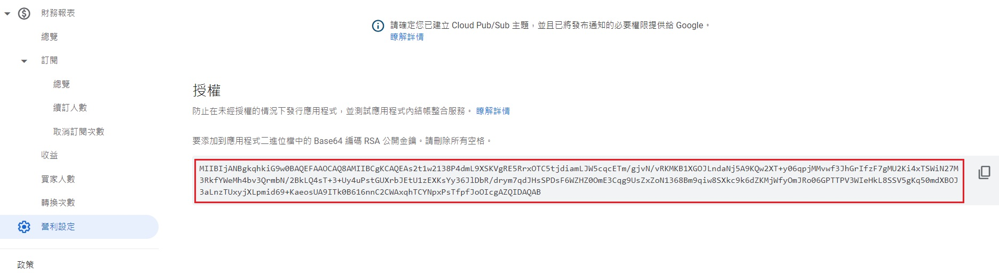

# 發佈

## Google Play Console端
1. 先按照指示把一些問卷填完。
2. 接受Play App Signing。
3. 把打包好的遊戲上傳。
4. 在公開測試上傳遊戲（以Evil Zombie來說6/15上6/19審過）。
5. 審查似乎不管遊戲內容，因為Evil Zombie下載後其實不能玩（進入遊戲前有報錯只能結束），但審查過了。
6. 公開測試要審核。(第一次要4天，之後1-2小時)
7. 內部測試、封閉測試、公開測試之間Store Version不可相同。
8. 內部測試推出後要到可以下載到最新版本，大約要等近0-1hr。（內部測試推出，電腦連到Google Play看到的是最新版本，但透過電腦安裝此正確版本到手機，手機端會看到GooglePlay上仍是舊版本。第2次嘗試則直接安裝到最新版本，幾乎不用等，如果不是最新稍微重新進入頁面通常頁面資訊也會更新到最新。）

## 更新版本
1. 記得要變更Store Version(如1->2)，不然會報錯。
2. Project Setting => Android => Version Display Name 會出現在Google商店，手機上的應用程式資訊也會顯示（由此可判斷安裝版本為何）。

## IAP
要設置的東西零零碎碎不少，一個錯誤就無法成功

https://docs.unrealengine.com/4.26/en-US/SharingAndReleasing/Mobile/Android/InAppPurchases/
https://answers.unrealengine.com/questions/952902/simple-way-to-add-in-app-purchase-on-android-game.html
https://answers.unrealengine.com/questions/926244/android-in-app-purchase-1.html
https://docs.unrealengine.com/4.26/en-US/SharingAndReleasing/Mobile/Android/InAppPurchases/
https://answers.unrealengine.com/questions/961826/iap-android-not-working-on-425.html
https://forums.unrealengine.com/t/integrate-google-play-services-with-blueprint/46012
https://answers.unrealengine.com/questions/457148/cant-get-read-iap-node-to-work.html
https://forums.unrealengine.com/t/problem-with-read-iap-node/69690/9

1. 測試時以內部、封閉測試版，不建議Local調試。
2. 勾起Enable Google Play Support，並填妥該區內容。
3. 若要測試是否連上Play Store，可以呼叫Show External Login UI，看是否能連接到帳戶。（Play 遊戲服務設定需填）
4. Project Settings - Advanced APK Packaging - Extra Permissions需填入'com.android.vending.BILLING'及'android.permission.GET_ACCOUNTS'。
5. 確定Plugin－Online Subsystem Google Play有啟用。
6. Request Token ON Connected，這個勾起來後會跳是否允許應用程式取得聯絡人資料的Modal，所以不要勾。
7. 4.26版的話API要用V2版才能成功
game app id:

Google Play License key

## 隱私權
過去星繪製作的隱私權網址連結
https://privacy-b9da8.web.app/

## 實機Debug
1. 查詢Logk位置（要產出Log要有寫入Storage的權限但是我還是沒看到log...）[ref](https://answers.unrealengine.com/questions/134079/where-can-i-find-the-ue4-log-file-on-android-devic.html)
2. 可以在Android的Log訊息中過濾出標籤以UE4的內容。[ref](https://forums.unrealengine.com/t/debugging-mobile/56094/2)
        adb logcat -s UE4 -s debug -s DEBUG

## Google Analytics
1. 使用Firebase - Features插件
2. Editor中無用，但直接安裝到手機上就有效，不用上傳到GooglePlay。

