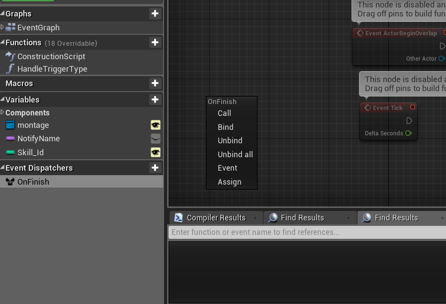

# Event Dispatcher（事件分配器）

## 概念

A事件發生，會告知B、C、D...等事件要跟著發生。
概念上如同Javascript的addEventListener，只是在OOP的設計模式中，是各類去向某一類註冊自己的CallBack函數。

以函數來說只是幫助理解，更精確地說是事件（類似C#）本位，以棒球作說明，設球被打擊到，球本身會觸發A事件即被擊中，而B事件屬於球員叫準備跑壘，
C事件屬於裁判叫進行觀察。

這種情況，會在球類上創建Event Dispatcher，任何要觸發的事件，不論是自己或者別人的，都要在這邊註冊（Bind），當程式碼運行過程中要觸發這些註冊的事件，則利用呼叫（Call）的功能以觸發所有註冊的事件；所以上述的A事件，要在自身的BP綁定，B、C則是要引用球類實例，去把自己身上的事件註冊到球類的Event Dispatcher上。

通常Event Dispatcer的使用大致上就是為了要告知某一特定事件的發生，如A事件（被擊中），所以Event Dispatcher的命名就當作該事件命名即可（例如OnHit），需要搞清楚的只是光只有Event Dispatcher是不會觸發任何事件的，因為它就只是調度器，所以球類自己必須創建一個事件並把它註冊到這上面才行。

* Call: 告知、觸發所有註冊的事件，順序即訂閱順序
* Bind: 將任意事件註冊在分配器上
* Unbind: 取消註冊
* Unbind all: 取消分配器上的所有註冊（吧
* Event: 幫你在EventGraph貼上這個分配器預設好的一個事件，只是讓你省力不用自己創一個。還需要Bind才會被觸發
* Asign: 就是幫你一次作好上述的Event跟Bind的功能（幫你一次貼上兩個Node）

::: tip
子類可在EventGraph放上母類具有的事件，其作用等同Override，母類在該事件宣告的程式碼不會執行，如要執行，要在子類的該事件上右鍵選Add call to parent function。
:::