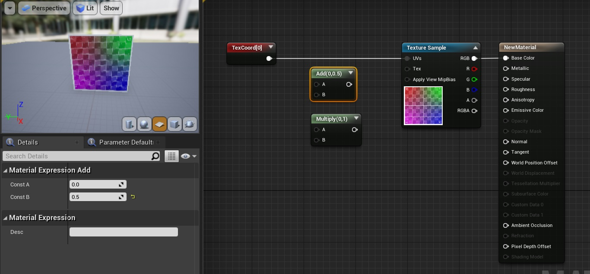

# 材質

## 總論

以下敘述皆為針對UE4所言，其他引擎或軟體的定義可能不同。

材質（Material）： 是眾多色彩、光影、粗糙度等資訊的最終產出結果，通常會透過紋理進行運算、疊加而產出。

紋理（texture）：以像素為單位的數據，每個像素可為RGB或RGBA，而R、G、B、A的數值皆介於0-1之間，而非一般常用之0-255。

## UV mapping
### UV定義
一般而言，(u,v)是指2D平面的座標，因為(x,y,z)已經拿來描述3D物體表面各點的位置。（p為point之意）

[官網說明](https://docs.unrealengine.com/en-US/WorkingWithContent/Types/StaticMeshes/HowTo/UVChannels/index.html)

### UE4的Texture Coord Node

**TexCoord：**
為TextureCoordinate的縮寫（照全名打才搜尋得到），而其輸出，是一組值介於0-1的(u,v)座標，
表示某一3D物體表面各點投射回uv平面的座標位置，而投射方式可以有很多種，於是對應的(u,v)座標組也會隨之不同。
如圖中左下之Coordinate Index就是在選擇投射方式。

一些簡單幾何UE4引擎只預設提供一種投射方式，例如說preview視窗的plane，就是(0,y,z)=>(y,z)=>(u,v)，
至於其他mesh的投影關係，則直接點入該介面去看最快，例如cylinder。

選擇UV

UV Channel 0

UV Channel 1

如上，所以調動Coordinate Index，就會對應到特定的映射方式，也就是一般所謂的uv-mapping圖。

已經知道texture coordinate node輸出的數值意義了，那麼針對該輸出進行操作呢？

原本：

加0.5：

乘2：

操作原理請看下4張圖。

加法：

相較原本，各3D點位所對應的(u,v)位置往右上移動：

乘法(>1)：

相較原本，各3D點位所對應的(u,v)位置集合所涵蓋的範圍加大：

[截圖來源影片](https://www.youtube.com/watch?v=bu8kGs1ap54&ab_channel=TechArtAid)

以上便是紋理操作的基礎知識，弄懂之後才有辦法作一些材質的基本操作唷。

## Landscape
landscape如果使用材質，則材質內的紋理會重複出現，此與一般plane的行為不同（1張texure放至最大）。
如下圖，起初使用TexCoord並乘1（即等同未接TexCoord時之預設值），可見1張紋理對應Landscape上1格，
而乘以0.5，可以看出超出Landscape之每格，只對應到原本紋理長寬的一半，且超過處會自動對應。

