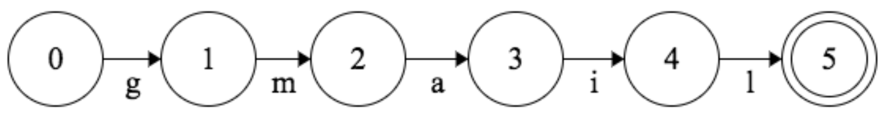
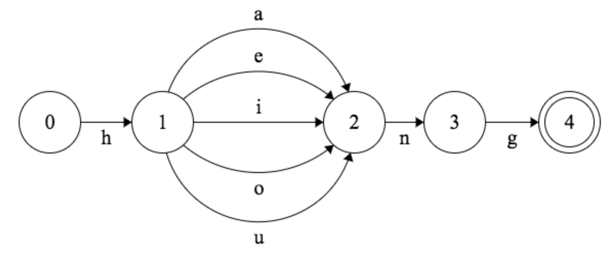
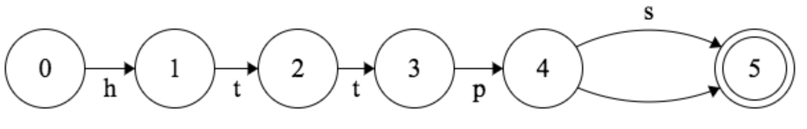
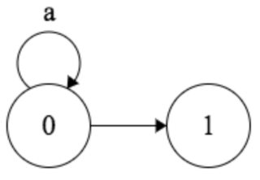
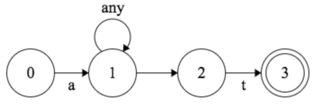
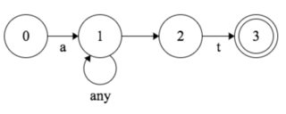

# Regex
<!-- <test/> -->
## Set

`[]` : characters to pick up.

examples:

    [abcde]、[a-e]、[^a-e]、[a-zA-Z]

## Quantifier

`?` : optional.

`*` : get as many as possible (***include*** getting nothing).

`+` : get as many as possible (***exclude*** getting nothing).

`{min,max}` : match times range. both are optional.

## Boundary

**start of line**

`^` : match from ***first*** character ***after*** line break. (at most 1 result per line).

**end of line**

`$` : match from ***last***  character ***before*** line break. (at most 1 result per line).

**word-boundary**

`\bfoo\b` : get separated word.

**look ahead**

`(?=foo)` : do matching with that suffix.

`(?!=foo)` : do matching without that suffix.

**look behind**

`(?<=foo)` : do matching with that prefix.

`(?<!=foo)` : do matching without that prefix.

 
 

## State Machine In Regex

scenario1 : search for `gmail` word.

    /gmail/

There is a stuff would be with several statuses.
0-node means initial status, and when the required event occurs, the status transforms to the next status.
When the final status is reached, this matching succeeds.

 

scenario2 :

    /h[aeiou]ng/

Q : when does status1(node1) move to 2 ?

A : one of `a` or `e` or ... `u` event occurs with topdown order.

scenario3 :

    /https?/

Stauts 5 can be reached either with or without `s`.

scenario4 :

    /a*/

Examine Order: 1.top to down 2.left to right
This figure means getting a as many as possible, and once finished the examination, move from left to right with null condition(require nothing).

scenario5 :

    /a.*t/

scenario6 :

    /a.*?t/

Due to `Examine Order` changing, once staisfying null condition, the matching succeeds.

reference:
[咻咻的筆記小站](https://hengxiuxu.blogspot.com/2017/10/regular-expression.html)